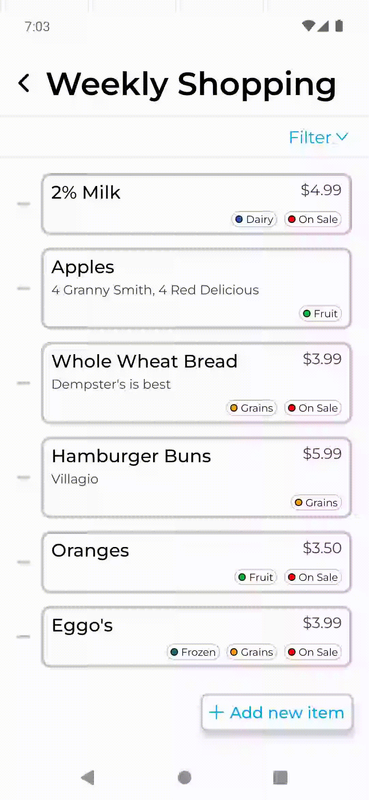

<div align="center">

  
  <h1>MyGroceryPal</h1>
  
  <h2><strong><em>
    A simple, easy, and elegant way to manage your grocery lists!
  
  </em></strong></h2>
</div>

## About the App

#### Store all your grocery lists in one place!

<div align="center">
  
</div>

#### Easily add new items to a list, with the ability to include optional info such as any additional notes, price, and whether or not the item is on sale. Furthermore, you can effortlessly categorize your list items by adding custom tags!

<div align="center">
  
</div>

#### Confidently find the items that you're looking for with the ability to filter your list items based on their tags!
<div align="center">
  
</div>

## Built With
-  React Native
-  TypeScript

## Getting Started

### Prerequisites
- You must have your React Native development environment set up already. If not, follow [this](https://reactnative.dev/docs/environment-setup) guide.

### Running Locally
If you wish to run a copy of the MyGroceryPal app locally to test it out, simply follow these steps:
- Clone the project: 
```bash
git clone https://github.com/ericdaddario02/MyGroceryPal_App.git
```
- Go to the project directory:
```bash
cd MyGroceryPal_App
```
- Install node modules:
```bash
npm install
```
- Run the app!
```bash
npm run android
# or
npm run ios
```
